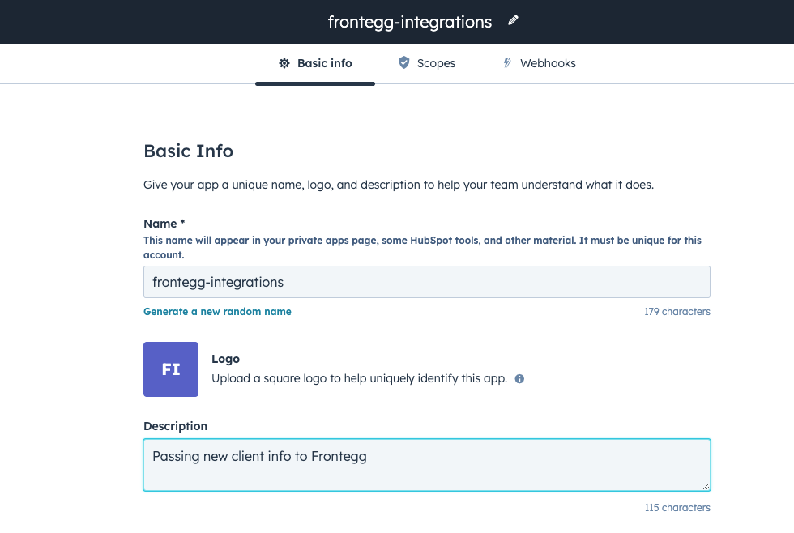
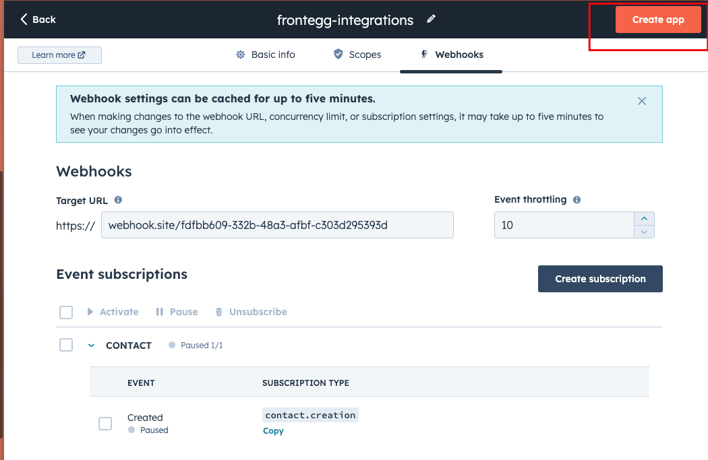
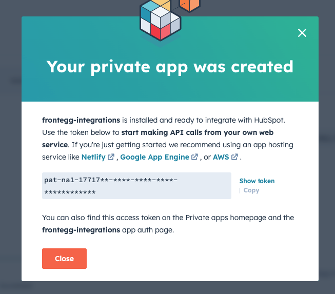

# HubSpot Integration with Frontegg

Screen recording with final result

[HubSpot_Integration_with_Frontegg_video](images/HubSpot_Integration_with_Frontegg_video.qt)

## Step 1 - running the test app

- Clone the repo
    
    ```jsx
    git clone https://github.com/fxcircus/frontegg-hubspot-integration.git
    ```
    
    *You will need to finish step 2 to get the `HUBSPOT_APPLICATION_TOKEN` for the script
    
- Log in to your Frontegg account to get the rest of the values for the script
    
    ```jsx
    const FRONTEGG_CLIENT_ID = 'FRONTEGG_CLIENT_ID'; // "Client ID" from Frontegg Portal ➜ [ENVIRONMENT] ➜ Env Settings page
    const FRONTEGG_SECRET = 'FRONTEGG_SECRET'; // "API key" from Frontegg Portal ➜ [ENVIRONMENT] ➜ Env Settings page
    const TENANT_ID_TO_INVITE_IN_FRONTEGG = 'TENANT_ID_TO_INVITE_IN_FRONTEGG'; // The account to invite to in Frontegg
    const FRONTEGG_ROLES_ARRAY = ["FRONTEGG_ROLES_ARRAY"] // At least one roleId from Frontegg Portal ➜ [ENVIRONMENT] ➜ Entitlements ➜ Roles
    ```
    

## Step 2 - HubSpot app setup

- Login to your HubSpot account.
- Click the S`ettings` icon in the top right corner (gear icon).
- Navigate to the **`Integrations`** section, click on **`Private apps` ➜ `Create a private app`** ➜ set a name and description
    
    
    
- Click on the `Scopes` tab ➜ add the following scopes-
  `crm.schemas.contacts.read` , `crm.objects.contacts.read`
- Click on the `Webhooks` tab ➜ `Create subscription` ➜ Select the following options
    
    ```jsx
    which object types?
    Contact
    
    Listen for which events?
    Created 
    ```
    
    Click `Subscribe` ➜ `Create App`
    
    
    
- Once the app is created, you will get an API token, add this value to the `HUBSPOT_APPLICATION_TOKEN` from step 1
    
    
    

## Step 3 - Creating new contact in HubSpot

- Login to your HubSpot account
- Navigate to the CRM section by clicking `CRM` in the main navigation bar
- Select `Contacts` from the left sidebar menu
- Click the `Create contact` button in the upper right corner
- In the right panel, enter the client's details like `first name`, `last name`, and `email`
- Click `Save` to create the new client contact
- That’s it! the user should get the invite to join your Frontegg account.

## Suggestions for next steps and improvements

- You can call [Frontegg’s Signup API endpoint](https://docs.frontegg.com/reference/userscontrollerv1_signupuser) instead of the invite endpoint
This endpoint creates a new tenant for the user instead of inviting to an existing tenant. And the user will get the default roles from your Frontegg environment instead of you needing to set the roleIds.
- Consider changing `getFronteggBearerToken` to run every 24 hours instead of every time you get a new request, this will save time and redundant calls. The bearer token JWT is valid for 24 hours,
